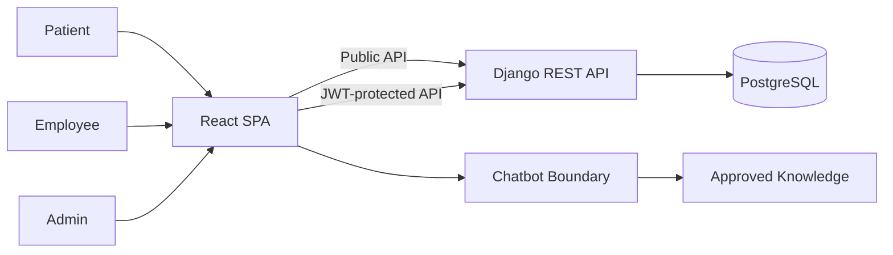

# System Context

## Actors và hệ thống liên quan

| Thành phần | Vai trò |
|---|---|
| Patient | Xem bác sĩ, đặt lịch và nhận email xác nhận; không bắt buộc đăng nhập |
| Employee | Quản lý bệnh nhân và xử lý lịch hẹn |
| Admin | Có toàn bộ quyền của Employee, quản lý bác sĩ, chuyên khoa và tài khoản |
| Chatbot | Trả lời thông tin phòng khám, quy định và kiến thức sức khỏe phổ thông |
| MediBook | Tiếp nhận request, áp dụng nghiệp vụ, xác thực và lưu dữ liệu |
| PostgreSQL | Lưu tài khoản, bác sĩ, chuyên khoa, bệnh nhân và lịch hẹn |

## Trust boundary

- Public boundary: Patient và chatbot không được truy cập API nội bộ.
- Authentication boundary: Employee/Admin phải có JWT hợp lệ.
- Data boundary: dữ liệu bệnh nhân và lịch hẹn chỉ được trả về qua endpoint có permission.
- Chatbot boundary: chatbot không query trực tiếp bảng nghiệp vụ nhạy cảm.
- SPA boundary: public routes và protected `/admin/*` routes cùng thuộc một frontend; route guard chỉ hỗ trợ UX, backend vẫn quyết định quyền.

## Luồng dữ liệu đặt lịch

1. Patient chọn chuyên khoa, bác sĩ tùy chọn, ngày và buổi.
2. API validate dữ liệu và chuẩn hóa số điện thoại.
3. API tìm hoặc tạo Patient trong transaction.
4. API tạo Appointment ở trạng thái `CONFIRMED`; bác sĩ có thể để trống theo nhu cầu của bệnh nhân.
5. API trả `booking_code` làm mã tham chiếu và gửi email xác nhận.
