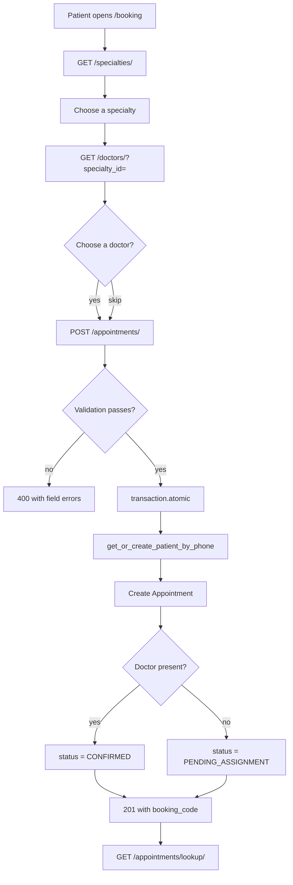
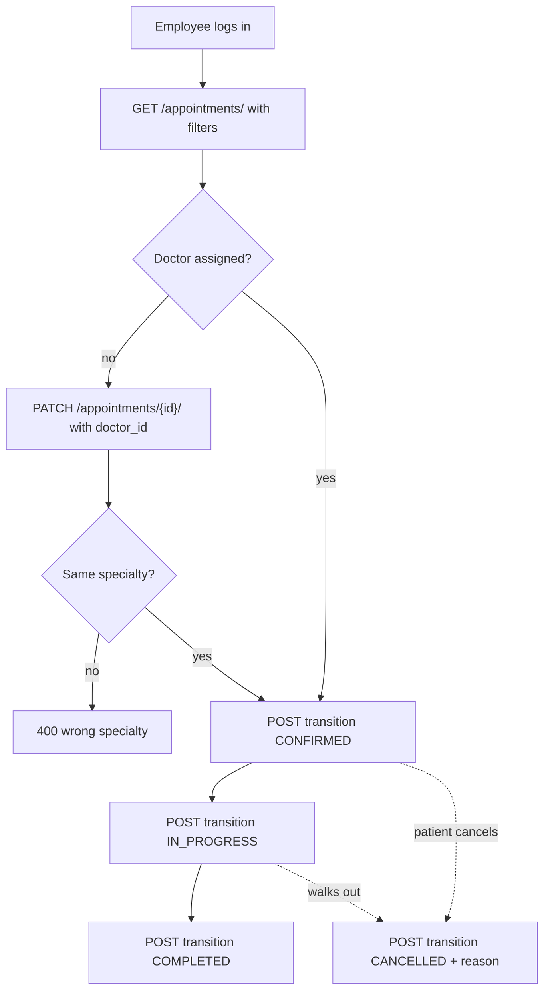
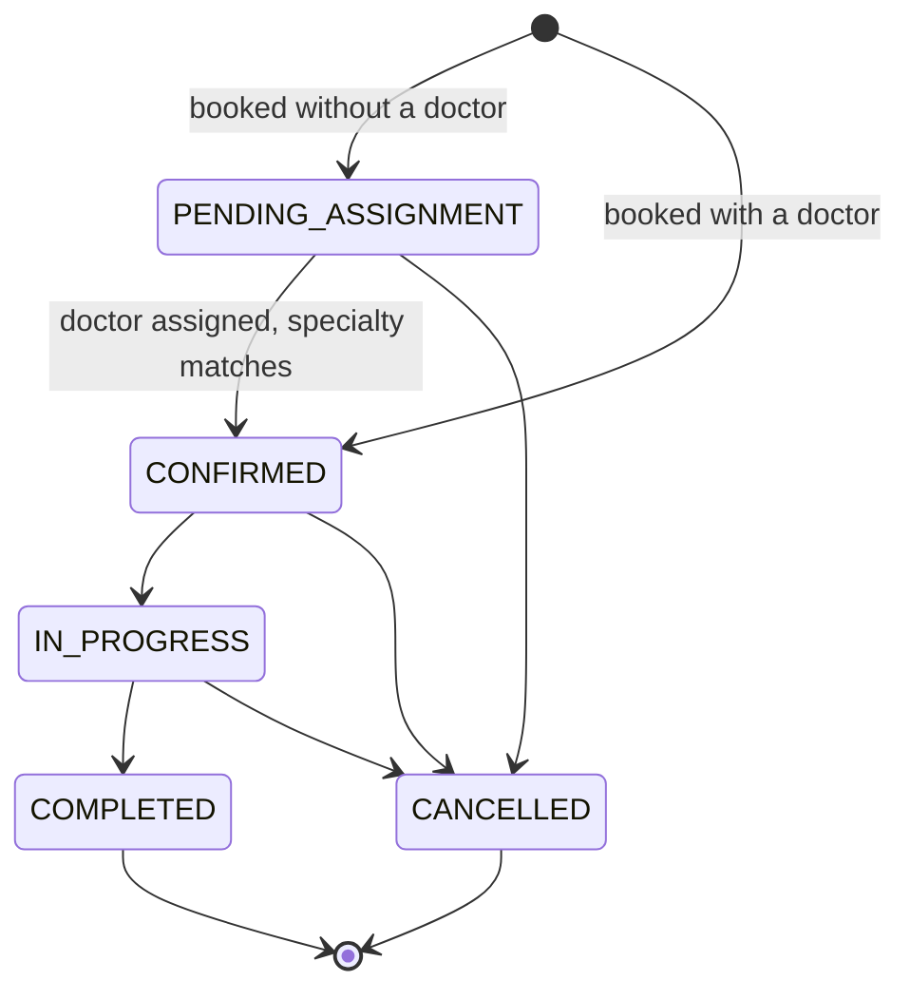

# Appointments, Booking and Lookup

Developer 4's slice: the path from a patient booking without an account to an
employee closing the visit. This is the handover for `feature/appointments`.

## Sources

- Requirement: `inception/plainning/đặc-tả-mvp-và-quy-tắc-nghiệp-vụ.md#8-quy-tắc-đặt-lịch`, `#10-trạng-thái-lịch-hẹn`, `#11-tra-cứu-lịch-hẹn-công-khai`
- Database: `inception/plainning/thiết-kế-database-và-erd.md#4.6-appointments`
- Architecture: `inception/architecture/api-contract.md`
- Upstream contract: `apps.patients.services.get_or_create_patient_by_phone` (Developer 2)

## Acceptance criteria

- [x] `Appointment` with a UUID booking code, session, status and cancellation data
- [x] Patient find-or-create and appointment creation share one `transaction.atomic()`
- [x] Doctor belongs to the selected specialty; referenced records are active; date is valid
- [x] Status transitions follow a legal state machine, enforced server-side
- [x] Public booking and public lookup, no account required
- [x] Employee screen to filter, assign, and process appointments
- [x] No uniqueness constraint on (doctor, date, session) — deliberate, per spec 8.8
- [x] Tests cover validation, atomicity and illegal transitions
- [x] Seed command for manual testing

## The end-to-end flow

A patient picks a specialty, optionally a doctor, a date and a session, then
leaves their name and phone. The backend normalises the phone, reuses the
patient record if that number is already known, and creates the appointment in
the same transaction — so a validation failure never leaves an orphaned
patient behind.

Choosing a doctor matters: it decides the starting status. With a doctor the
appointment is `CONFIRMED` immediately; without one it waits at
`PENDING_ASSIGNMENT` until an employee assigns someone from the right
specialty. Either way the patient gets a booking code back and can look the
appointment up later by that code or by phone.



On the other side, an employee logs in, filters the day's list, assigns a
doctor where one is missing, and walks the appointment through the visit. Every
transition is checked against the state machine before it is written, and a
cancellation always carries a reason.



## Status state machine

`COMPLETED` and `CANCELLED` are terminal. A direct jump from `CONFIRMED` to
`COMPLETED` is rejected — the visit has to be recorded as started first.



## Implementation map

| Layer | Files | Responsibility |
|---|---|---|
| Database | `appointments/migrations/0001_initial.py` | `appointments` table, 4 CHECK constraints, 5 indexes |
| Model | `appointments/models.py`, `state.py` | Fields and choices; legal transition table |
| Service | `appointments/services.py` | Booking transaction, validation, lookup, search, transitions |
| API | `appointments/{views,serializers,urls}.py` | Public booking and lookup; internal list, detail, transition |
| Provisional | `specialties/*`, `doctors/*` | Stand-in models and read API until Developer 3 ships theirs |
| Frontend | `pages/{Booking,Lookup,AdminAppointments}Page.tsx`, `shared/api/appointments.ts` | Three screens and the typed client |
| Seed | `appointments/management/commands/seed_demo.py` | Demo data across every status |
| Tests | `appointments/tests/*`, `*.test.tsx` | 109 backend, 19 frontend |

## Validation rules

| Rule | Enforced where | Message |
|---|---|---|
| Doctor belongs to the selected specialty | service, and again on `CONFIRMED` | Bác sĩ không thuộc chuyên khoa đã chọn. |
| Doctor is active | service | Bác sĩ đã ngừng hoạt động. |
| Specialty exists and is active | service | Chuyên khoa đã ngừng hoạt động. |
| Date not past, within 90 days | service | Ngày khám không được ở trong quá khứ. |
| Session is MORNING or AFTERNOON | serializer, service, DB CHECK | Buổi khám phải là MORNING hoặc AFTERNOON. |
| Reason not blank | service | Lý do khám là bắt buộc. |
| Phone normalised to `0xxxxxxxxx` | `patients.phone.normalize_phone` | Số điện thoại phải gồm 10 chữ số… |
| Transition is legal | `state.assert_can_transition` | Không thể chuyển trạng thái từ X sang Y. |
| Cancellation carries a reason | service, DB CHECK | Lý do hủy không hợp lệ. |
| Active appointment has a doctor | DB CHECK | `IntegrityError` |

Error messages stay in Vietnamese: they are shown to patients, and the rest of
the repo does the same.

## API collection

Base URL `http://localhost:8000/api/v1`.

### Public — book an appointment

```bash
curl -X POST http://localhost:8000/api/v1/appointments \
  -H 'Content-Type: application/json' \
  -d '{
    "full_name": "Nguyễn Văn An",
    "phone": "0901234567",
    "email": "an.nguyen@example.com",
    "specialty_id": 1,
    "doctor_id": 1,
    "appointment_date": "2026-10-05",
    "session": "MORNING",
    "reason": "Khám tổng quát"
  }'
```

```json
{
  "booking_code": "36062497-b56a-41d0-9797-4776d38fd978",
  "specialty_name": "Nội tổng hợp",
  "doctor_name": "Trần Văn Bình",
  "appointment_date": "2026-10-05",
  "session": "MORNING",
  "session_display": "Buổi sáng",
  "status": "CONFIRMED",
  "status_display": "Đã xác nhận"
}
```

Send `"doctor_id": null` and the status comes back `PENDING_ASSIGNMENT` with
`doctor_name` null. The visit reason and the patient's identity are never in
this response.

### Public — look up

```bash
# by booking code
curl 'http://localhost:8000/api/v1/appointments/lookup?booking_code=36062497-b56a-41d0-9797-4776d38fd978'

# by phone, returns every appointment on that number
curl 'http://localhost:8000/api/v1/appointments/lookup?phone=0901234567'
```

Either criterion alone is enough. Supplying neither is a `400`; a criterion
that matches nothing is a `404`, and it never leaks another patient's rows.

### Internal — log in

```bash
curl -X POST http://localhost:8000/api/v1/auth/token/ \
  -H 'Content-Type: application/json' \
  -d '{"username": "nhanvien", "password": "Employee@12345"}'
```

Use the `access` value as `Authorization: Bearer <token>` below.

### Internal — filter the list

```bash
curl -H "Authorization: Bearer $TOKEN" \
  'http://localhost:8000/api/v1/appointments/?date=2026-10-05&status=CONFIRMED'

# also: doctor_id, patient_id, and q over patient name, phone or booking code
curl -H "Authorization: Bearer $TOKEN" \
  'http://localhost:8000/api/v1/appointments/?q=0901234567'

# paginated: page (default 1) and page_size (default 20, max 100)
curl -H "Authorization: Bearer $TOKEN" \
  'http://localhost:8000/api/v1/appointments/?page=2&page_size=20'
```

This list — and only this list — returns a paginated envelope; every other
endpoint still returns a plain array, since the project has no global DRF
pagination. An out-of-range or non-integer `page` is clamped, never a 500.

```json
{
  "results": [ ... ],
  "count": 42,
  "page": 2,
  "page_size": 20,
  "total_pages": 3
}
```

### Internal — assign a doctor, then walk the visit

```bash
curl -X PATCH http://localhost:8000/api/v1/appointments/3 \
  -H "Authorization: Bearer $TOKEN" -H 'Content-Type: application/json' \
  -d '{"doctor_id": 1}'

curl -X POST http://localhost:8000/api/v1/appointments/3/transition \
  -H "Authorization: Bearer $TOKEN" -H 'Content-Type: application/json' \
  -d '{"status": "CONFIRMED"}'

curl -X POST http://localhost:8000/api/v1/appointments/3/transition \
  -H "Authorization: Bearer $TOKEN" -H 'Content-Type: application/json' \
  -d '{"status": "IN_PROGRESS"}'

curl -X POST http://localhost:8000/api/v1/appointments/3/transition \
  -H "Authorization: Bearer $TOKEN" -H 'Content-Type: application/json' \
  -d '{"status": "COMPLETED"}'
```

### Internal — cancel

```bash
curl -X POST http://localhost:8000/api/v1/appointments/3/transition \
  -H "Authorization: Bearer $TOKEN" -H 'Content-Type: application/json' \
  -d '{"status": "CANCELLED", "cancellation_reason": "NO_SHOW"}'
```

`DELETE /appointments/{id}/` does the same thing: it cancels rather than
destroys, so history survives. Reasons are `PATIENT_REQUEST`, `CLINIC`,
`NO_SHOW`.

### Errors worth trying

| Request | Response |
|---|---|
| `doctor_id` from another specialty | `400` `{"doctor_id": ["Bác sĩ không thuộc chuyên khoa đã chọn."]}` |
| `appointment_date` in the past | `400` `{"appointment_date": [...]}` |
| `CONFIRMED` → `COMPLETED` | `400` `{"status": ["Không thể chuyển trạng thái từ CONFIRMED sang COMPLETED."]}` |
| `CANCELLED` with no reason | `400` `{"cancellation_reason": [...]}` |
| `GET /appointments/` without a token | `401` |
| Lookup with an unknown code | `404` |

## Running it

```bash
docker compose up --build -d
docker exec medibook-backend-1 python manage.py seed_demo --reset
```

Seeding gives four specialties (one inactive), seven doctors (one inactive),
five patients, and ten appointments spanning all five statuses. Two of them
deliberately share a doctor, date and session, so the missing uniqueness
constraint is visible in the data.

Logins: `admin / Admin@12345`, `nhanvien / Employee@12345`.

Screens: `/booking`, `/lookup`, and `/admin/appointments` after logging in.

## Evidence

| Check | Result |
|---|---|
| `manage.py check` | no issues |
| `makemigrations --check --dry-run` | no drift |
| `migrate` from an empty database | specialties → doctors → appointments |
| Backend tests | 109 passed |
| Frontend typecheck, lint, tests, build | passed, 19 tests |

## Handover notes

Three things the next person should not have to rediscover.

**The provisional specialty and doctor models are mine, not Developer 3's.**
`feature/specialties-doctors` shipped frontend only, so `apps/specialties` and
`apps/doctors` were empty stubs and nothing here could migrate. They follow the
ERD exactly and live in their own commits so they can be dropped whole.

**The frontend and the ERD disagree about doctors.**
`shared/api/doctors.ts` models a doctor as belonging to many specialties with
an `is_primary` flag, and `AdminDoctorsPage.tsx` really does build that array.
The ERD and spec 7.3 give each doctor exactly one specialty. This has to be
settled before the merge into `dev`. If the many-to-many wins, the only backend
change is `doctor_matches_specialty` in `services.py`, plus the doctor model
itself and one filter line in `AdminAppointmentsPage.tsx`.

**Two judgement calls are open.**
`IN_PROGRESS → CANCELLED` is allowed here, following the ERD section 8; the MVP
spec's diagram omits it. And the 90-day booking window is mine — the spec only
says "future, or per the clinic's intake rules".
