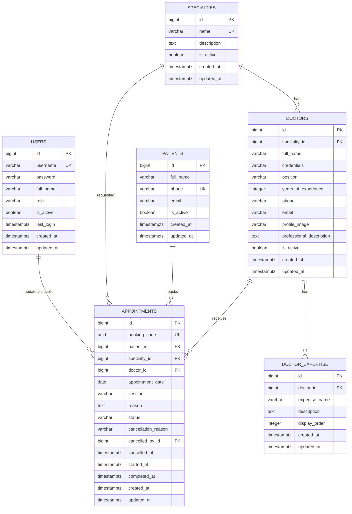

# THIẾT KẾ DATABASE VÀ ERD – MEDIBOOK MVP

## 1. Phạm vi thiết kế

Database phục vụ các luồng trong MVP:

- Bệnh nhân đặt lịch công khai và nhận thông tin qua email xác nhận.
- Employee quản lý bệnh nhân và lịch hẹn.
- Admin quản lý bác sĩ, chuyên khoa và tài khoản nội bộ.
- Dashboard thống kê từ dữ liệu lịch hẹn.
- Chatbot AI sử dụng nội dung công khai của phòng khám và quy tắc nghiệp vụ.

Thiết kế ưu tiên đơn giản, dễ triển khai bằng Django ORM và PostgreSQL. Chưa đưa vào các đối tượng ngoài MVP như ca làm việc, phòng khám, thanh toán, hồ sơ bệnh án và thông báo.

## 2. Danh sách bảng

| Bảng | Mục đích |
|---|---|
| `users` | Tài khoản đăng nhập nội bộ của Admin/Employee |
| `specialties` | Danh mục chuyên khoa |
| `doctors` | Thông tin bác sĩ |
| `doctor_expertise` | Các lĩnh vực chuyên sâu của bác sĩ |
| `patients` | Hồ sơ bệnh nhân, nhận diện theo số điện thoại |
| `appointments` | Lịch hẹn khám và trạng thái xử lý |

Chatbot không bắt buộc thêm bảng trong MVP. Nội dung nền tảng có thể được quản lý bằng file Markdown/JSON version-controlled; hội thoại nên xử lý stateless hoặc lưu tạm ở backend để hạn chế lưu dữ liệu sức khỏe nhạy cảm.

## 3. Mô hình quan hệ



## 4. Chi tiết các bảng

### 4.1. `users`

Lưu tài khoản nội bộ. Có thể triển khai bằng custom Django User kế thừa `AbstractUser`; không lưu mật khẩu dạng thuần.

| Cột | Kiểu PostgreSQL | Ràng buộc | Mô tả |
|---|---|---|---|
| `id` | `bigint` | PK | Khóa chính |
| `username` | `varchar(150)` | NOT NULL, UNIQUE | Tên đăng nhập |
| `password` | `varchar(128)` | NOT NULL | Mật khẩu đã được Django hash, không lưu dạng thuần |
| `full_name` | `varchar(150)` | NOT NULL | Tên hiển thị |
| `role` | `varchar(20)` | NOT NULL | `ADMIN` hoặc `EMPLOYEE` |
| `is_active` | `boolean` | NOT NULL, DEFAULT `true` | Khóa/mở tài khoản |
| `last_login` | `timestamptz` | NULL | Lần đăng nhập gần nhất |
| `created_at` | `timestamptz` | NOT NULL | Thời điểm tạo |
| `updated_at` | `timestamptz` | NOT NULL | Thời điểm cập nhật |

Ghi chú: ở mức triển khai Django nên dùng cột `password` chuẩn của Django (`varchar(128)`), không dùng tên `password_hash` nếu muốn tương thích trực tiếp với `AbstractUser`.

### 4.2. `specialties`

| Cột | Kiểu PostgreSQL | Ràng buộc | Mô tả |
|---|---|---|---|
| `id` | `bigint` | PK | Khóa chính |
| `name` | `varchar(150)` | NOT NULL, UNIQUE | Tên chuyên khoa |
| `description` | `text` | NULL | Mô tả |
| `is_active` | `boolean` | NOT NULL, DEFAULT `true` | Chuyên khoa còn sử dụng |
| `created_at` | `timestamptz` | NOT NULL | Thời điểm tạo |
| `updated_at` | `timestamptz` | NOT NULL | Thời điểm cập nhật |

### 4.3. `doctors`

Một bác sĩ thuộc đúng một chuyên khoa trong MVP.

| Cột | Kiểu PostgreSQL | Ràng buộc | Mô tả |
|---|---|---|---|
| `id` | `bigint` | PK | Khóa chính |
| `specialty_id` | `bigint` | NOT NULL, FK | Tham chiếu `specialties.id` |
| `full_name` | `varchar(150)` | NOT NULL | Họ tên bác sĩ |
| `credentials` | `varchar(100)` | NULL | Học hàm/học vị, ví dụ `BS.CKII`, `TS.BS` |
| `position` | `varchar(150)` | NULL | Chức vụ, ví dụ `Trưởng khoa Nội Tổng hợp` |
| `years_of_experience` | `integer` | NULL, CHECK >= 0 | Số năm kinh nghiệm |
| `phone` | `varchar(20)` | NOT NULL | Số điện thoại |
| `email` | `varchar(254)` | NULL | Email |
| `profile_image` | `varchar(100)` | NULL | Đường dẫn ảnh upload; file được lưu ở media storage |
| `professional_description` | `text` | NULL | Mô tả chuyên môn |
| `is_active` | `boolean` | NOT NULL, DEFAULT `true` | Có được hiển thị/đặt lịch hay không |
| `created_at` | `timestamptz` | NOT NULL | Thời điểm tạo |
| `updated_at` | `timestamptz` | NOT NULL | Thời điểm cập nhật |

Không xóa cứng bác sĩ đã có lịch hẹn. Khi ngừng hoạt động, đặt `is_active = false`.

### 4.4. `doctor_expertise`

Lưu nhiều lĩnh vực chuyên sâu của một bác sĩ. Mỗi dòng là một lĩnh vực và phần mô tả tương ứng.

| Cột | Kiểu PostgreSQL | Ràng buộc | Mô tả |
|---|---|---|---|
| `id` | `bigint` | PK | Khóa chính |
| `doctor_id` | `bigint` | NOT NULL, FK | Tham chiếu `doctors.id` |
| `expertise_name` | `varchar(200)` | NOT NULL | Tên lĩnh vực chuyên sâu |
| `description` | `text` | NULL | Mô tả hoặc các bệnh lý liên quan |
| `display_order` | `integer` | NOT NULL, DEFAULT `0` | Thứ tự hiển thị |
| `created_at` | `timestamptz` | NOT NULL | Thời điểm tạo |
| `updated_at` | `timestamptz` | NOT NULL | Thời điểm cập nhật |

Ví dụ: một bác sĩ có các dòng `Hồi sức nội – ngoại khoa`, `Bệnh lý nội thần kinh` và `Bệnh lý nội khoa`.

### 4.5. `patients`

Lưu hồ sơ bệnh nhân không có tài khoản đăng nhập. Số điện thoại phải được chuẩn hóa trước khi lưu.

| Cột | Kiểu PostgreSQL | Ràng buộc | Mô tả |
|---|---|---|---|
| `id` | `bigint` | PK | Khóa chính |
| `full_name` | `varchar(150)` | NOT NULL | Họ tên |
| `phone` | `varchar(20)` | NOT NULL, UNIQUE | Số điện thoại chuẩn hóa |
| `email` | `varchar(254)` | NULL | Email tùy chọn |
| `is_active` | `boolean` | NOT NULL, DEFAULT `true` | Trạng thái hồ sơ |
| `created_at` | `timestamptz` | NOT NULL | Thời điểm tạo |
| `updated_at` | `timestamptz` | NOT NULL | Thời điểm cập nhật |

Khi đặt lịch bằng số điện thoại đã tồn tại, dùng lại bản ghi bệnh nhân. Không ghi đè thông tin hiện có bằng giá trị rỗng.

### 4.6. `appointments`

Lưu lịch hẹn. Bệnh nhân bắt buộc chọn chuyên khoa nhưng có thể không chọn bác sĩ. Một bác sĩ có thể có nhiều lịch trong cùng ngày và cùng buổi; vì vậy không tạo unique constraint trên `doctor_id`, `appointment_date`, `session`.

| Cột | Kiểu PostgreSQL | Ràng buộc | Mô tả |
|---|---|---|---|
| `id` | `bigint` | PK | Khóa nội bộ |
| `booking_code` | `uuid` | NOT NULL, UNIQUE | Mã tham chiếu khó đoán, sinh bằng `gen_random_uuid()` hoặc Python `uuid4()` |
| `patient_id` | `bigint` | NOT NULL, FK | Tham chiếu `patients.id` |
| `specialty_id` | `bigint` | NOT NULL, FK | Chuyên khoa bệnh nhân yêu cầu |
| `doctor_id` | `bigint` | NULL, FK | Bác sĩ được chọn hoặc được Employee phân công sau |
| `appointment_date` | `date` | NOT NULL | Ngày khám |
| `session` | `varchar(20)` | NOT NULL | Chỉ nhận `MORNING` hoặc `AFTERNOON` |
| `reason` | `text` | NOT NULL | Lý do khám |
| `status` | `varchar(30)` | NOT NULL | `CONFIRMED`, `IN_PROGRESS`, `COMPLETED`, `CANCELLED` |
| `cancellation_reason` | `varchar(30)` | NULL | Ví dụ `PATIENT_REQUEST`, `CLINIC`, `NO_SHOW` |
| `cancelled_by_id` | `bigint` | NULL, FK | User nội bộ thực hiện hủy |
| `cancelled_at` | `timestamptz` | NULL | Thời điểm hủy |
| `started_at` | `timestamptz` | NULL | Thời điểm chuyển sang `IN_PROGRESS` |
| `completed_at` | `timestamptz` | NULL | Thời điểm chuyển sang `COMPLETED` |
| `created_at` | `timestamptz` | NOT NULL | Thời điểm tạo |
| `updated_at` | `timestamptz` | NOT NULL | Thời điểm cập nhật |

## 5. Quan hệ và chính sách xóa

| Quan hệ | Bội số | Chính sách đề xuất |
|---|---:|---|
| `specialties` – `doctors` | 1 – N | Không xóa chuyên khoa nếu còn bác sĩ; dùng `is_active = false` |
| `specialties` – `doctors` | 1 – N | `doctor.specialty_id` là bắt buộc |
| `doctors` – `doctor_expertise` | 1 – N | Xóa các lĩnh vực chuyên sâu khi xóa bác sĩ hoặc chặn xóa bác sĩ đã có lịch |
| `specialties` – `appointments` | 1 – N | Chuyên khoa yêu cầu luôn được lưu trên lịch hẹn |
| `patients` – `appointments` | 1 – N | `RESTRICT` hoặc soft-delete bệnh nhân; giữ lịch sử |
| `doctors` – `appointments` | 1 – N | `doctor_id` có thể NULL trước khi được phân công; giữ lịch sử khi đã có bác sĩ |
| `users` – `appointments.cancelled_by_id` | 1 – N | Có thể để NULL khi tài khoản bị vô hiệu hóa |

Với lịch hẹn, thao tác “xóa” trên giao diện nên chuyển trạng thái sang `CANCELLED`. Chỉ cân nhắc xóa cứng dữ liệu test hoặc lịch chưa có giá trị lịch sử.

## 6. Ràng buộc nghiệp vụ nên đặt ở database

Các ràng buộc dưới đây nên được khai báo bằng Django `CheckConstraint`, `UniqueConstraint` hoặc migration PostgreSQL:

```sql
CHECK (role IN ('ADMIN', 'EMPLOYEE'))
CHECK (session IN ('MORNING', 'AFTERNOON'))
CHECK (status IN ('CONFIRMED', 'IN_PROGRESS', 'COMPLETED', 'CANCELLED'))
CHECK (
    (status = 'CANCELLED' AND cancellation_reason IS NOT NULL)
    OR (status <> 'CANCELLED')
)
CHECK (years_of_experience IS NULL OR years_of_experience >= 0)
```

Ngoài database, service đặt lịch phải kiểm tra chuyên khoa đang hoạt động, bác sĩ đang hoạt động nếu được chọn, bác sĩ thuộc đúng chuyên khoa, ngày khám hợp lệ, chuẩn hóa số điện thoại và tạo bệnh nhân/lịch hẹn trong cùng transaction. Mọi lịch hợp lệ được tạo ở trạng thái `CONFIRMED`; `doctor_id` được phép NULL.

Không đặt constraint chống trùng lịch theo bác sĩ/ngày/buổi vì đặc tả MVP cho phép nhiều bệnh nhân đặt cùng một buổi.

## 7. Index đề xuất

```sql
CREATE UNIQUE INDEX ux_patients_phone ON patients (phone);
CREATE UNIQUE INDEX ux_appointments_booking_code ON appointments (booking_code);
CREATE INDEX ix_appointments_date ON appointments (appointment_date);
CREATE INDEX ix_appointments_doctor_date ON appointments (doctor_id, appointment_date);
CREATE INDEX ix_appointments_patient_date ON appointments (patient_id, appointment_date);
CREATE INDEX ix_appointments_status_date ON appointments (status, appointment_date);
CREATE INDEX ix_doctors_specialty_active ON doctors (specialty_id, is_active);
CREATE INDEX ix_doctor_expertise_doctor_order ON doctor_expertise (doctor_id, display_order);
CREATE INDEX ix_appointments_specialty_date ON appointments (specialty_id, appointment_date);
```

Các index này phục vụ tìm kiếm nội bộ theo mã/số điện thoại, lọc dashboard theo ngày, lọc lịch theo bác sĩ/bệnh nhân và lọc bác sĩ theo chuyên khoa.

## 8. Quy tắc chuyển trạng thái lịch hẹn

```text
CONFIRMED -> IN_PROGRESS -> COMPLETED
CONFIRMED -> CANCELLED
IN_PROGRESS -> CANCELLED   (chỉ khi nghiệp vụ thực tế cho phép)
```

Trong MVP, `COMPLETED` và `CANCELLED` là trạng thái kết thúc. Backend phải từ chối chuyển trạng thái ngược hoặc chuyển trực tiếp `CONFIRMED -> COMPLETED`. Lịch `CONFIRMED` không bắt buộc có bác sĩ.

## 9. Thiết kế dữ liệu cho chatbot AI

### 9.1. Phương án MVP đề xuất

Không lưu nội dung hội thoại chatbot vào PostgreSQL trong MVP. Chatbot chỉ nhận câu hỏi, truy xuất nội dung được phê duyệt và trả câu trả lời. Cách này giúp:

- Giữ database đơn giản.
- Giảm rủi ro lưu thông tin sức khỏe nhạy cảm của người dùng.
- Tránh biến chatbot thành một hồ sơ bệnh án.
- Dễ thay thế nhà cung cấp mô hình AI sau này.

Nguồn kiến thức ban đầu nên gồm các tài liệu được kiểm duyệt:

- Thông tin giới thiệu và liên hệ phòng khám.
- Danh sách chuyên khoa và bác sĩ đang hoạt động.
- Quy định đặt, đổi, hủy lịch hẹn và hướng dẫn liên hệ phòng khám.
- Nội dung sức khỏe phổ thông có nguồn rõ ràng và ngày rà soát.

Chatbot không được truy vấn trực tiếp bảng `patients` hoặc `appointments` và không hỗ trợ tra cứu lịch. Người dùng được hướng dẫn kiểm tra email xác nhận hoặc liên hệ phòng khám.

### 9.2. Phương án mở rộng sau MVP

Nếu cần lưu lịch sử trò chuyện hoặc cho Admin quản lý nội dung, có thể bổ sung:

- `chat_sessions`: `id`, `session_token` (UUID), `created_at`, `expires_at`.
- `chat_messages`: `id`, `session_id`, `role`, `content`, `safety_flag`, `created_at`.
- `knowledge_articles`: `id`, `title`, `content`, `category`, `source_url`, `is_active`, `reviewed_at`, `reviewed_by_id`.

Các bảng này chỉ nên được thêm khi có yêu cầu rõ về lịch sử, kiểm duyệt hoặc thống kê. Nội dung tin nhắn cần có chính sách lưu trữ và xóa dữ liệu riêng; không nên lưu số điện thoại, mã lịch hẹn hoặc thông tin bệnh lý nếu không cần thiết.

## 10. Gợi ý triển khai Django

- Dùng custom `User` ngay từ đầu, đặt `AUTH_USER_MODEL` trước migration đầu tiên.
- Dùng `TextChoices` cho `role`, `session`, `status` và `cancellation_reason`.
- Dùng `UUIDField(default=uuid.uuid4, unique=True, editable=False)` cho `booking_code`.
- Dùng `DateTimeField(auto_now_add=True)` và `DateTimeField(auto_now=True)` cho timestamp.
- Cấu hình `USE_TZ = True` và timezone hiển thị `Asia/Ho_Chi_Minh`.
- Dùng `transaction.atomic()` cho thao tác tạo/cập nhật bệnh nhân và lịch hẹn.
- Dùng `PROTECT` hoặc chặn xóa ở service layer đối với bác sĩ, chuyên khoa, bệnh nhân đã có dữ liệu liên quan.

## 11. Kết luận

Schema gồm 6 bảng nghiệp vụ là đủ cho MVP. `doctor_expertise` là bảng con một-nhiều của `doctors`, không phải bảng trung gian, vì mỗi lĩnh vực chuyên sâu được mô tả riêng cho từng bác sĩ. Không cần bảng trung gian `doctor_specialties` vì quy tắc hiện tại quy định mỗi bác sĩ chỉ thuộc một chuyên khoa.
